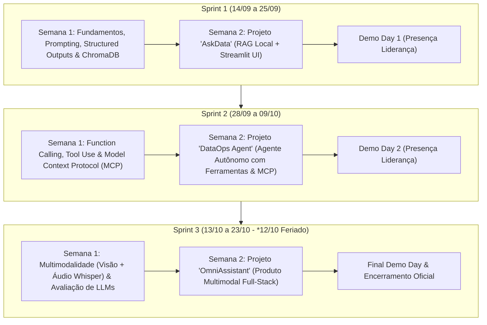

# 🧠 Grupo de Estudos em Inteligência Artificial Generativa
### Navi Hub (Tecnopuc) & DataLakers
**Período:** 14/09 a 23/10 | **Horário:** Segunda a Sexta, das 14h às 17h (3h/dia)  
**Carga Horária Total:** 90 horas presenciais (30 encontros) | **Público:** 15 alunos de Engenharia de Software e Sistemas de Informação da PUCRS (3º ao 5º semestre)

---

## 🎯 1. Visão Geral e Propósito
O Grupo de Estudos em Inteligência Artificial Generativa é uma iniciativa conjunta entre o **Navi Hub (Tecnopuc)** e a **DataLakers** com foco em:
1. **Capacitação Prática e Profunda:** Formar estudantes em tecnologias modernas de IA Generativa, saindo da teoria básica para a construção de sistemas reais (RAG, Agentes Autônomos, MCP e Multimodalidade).
2. **Captação de Talentos (Scouting):** Identificar, acompanhar e avaliar potenciais talentos da PUCRS para futuras oportunidades de estágio e desenvolvimento profissional na DataLakers.
3. **Ambiente Colaborativo:** Simular a rotina de squads ágeis de tecnologia, com dinâmicas diárias em duplas/trios, cerimônias de daily standup e Demo Days com a liderança técnica da empresa.

---

## 🗓️ 2. Estrutura do Programa em 3 Sprints

O programa é dividido em **3 Sprints de 2 semanas cada**. Cada Sprint adota uma metodologia em duas fases:
* **Semana 1 (Fundamentação & Dinâmicas Práticas):** Estudo imersivo com materiais gratuitos curados (vídeos, tutoriais interativos, gamificação) e desafios práticos diários em duplas ou trios.
* **Semana 2 (Desenvolvimento do Projeto da Sprint):** Desenvolvimento de um produto/serviço funcional de IA Generativa em trios, culminando em um **Demo Day com a presença da liderança da DataLakers**.

---

## 💻 3. Premissas Técnicas e Custo Zero (Sem Cartão de Crédito)

Todos os materiais, ferramentas e bibliotecas foram rigorosamente selecionados para garantir **100% de gratuidade e acessibilidade universal**, considerando que os alunos utilizarão seus próprios notebooks (Windows, macOS ou Linux, a partir de 8GB de RAM):

1. **APIs e Modelos Cloud Gratuitos:**
   - **Google AI Studio:** API key gratuita, sem necessidade de cartão de crédito e com limites generosos.
   - **Groq Cloud:** Inferência ultra-rápida gratuita sem cartão.
   - **Hugging Face Hub:** Acesso a modelos e datasets open-source.
2. **Execução Local (Offline/Edge):**
   - **Ollama:** Execução local de modelos leves (`llama3.2:1b/3b`, `qwen2.5-coder:1.5b/3b`, `phi3.5:3.8b`) para quem tiver hardware compatível.
   - **ChromaDB / FAISS:** Banco vetorial local in-memory e persistente em disco.
3. **Ambiente de Desenvolvimento:**
   - **VS Code:** Editor principal com terminal integrado e extensões Python.
   - **GitHub Copilot:** Acesso gratuito para estudantes universitários via [GitHub Student Developer Pack](https://education.github.com/pack).
   - **Python 3.11+ / venv:** Ambiente virtual isolado para gerenciamento de dependências.
   - **Streamlit:** Framework Python para interfaces web reativas e interativas.

---

## ⏰ 4. Estrutura do Encontro Diário (3 Horas)

| Bloco | Duração | Semana de Aprendizado (Semana 1) | Semana de Projeto (Semana 2) |
| :--- | :--- | :--- | :--- |
| **1. Abertura & Alinhamento** | 20 min (14:00 - 14:20) | Warm-up, provocação técnica e visão do dia | Daily Standup por trio (ontem, hoje, bloqueios) |
| **2. Imersão / Hands-on** | 70 min (14:20 - 15:30) | Estudo guiado (Crash courses, vídeos, leitura ativa) | Codificação em squad & mentoria técnica |
| **3. Intervalo & Conexão** | 15 min (15:30 - 15:45) | Coffee break, networking e descanso visual | Coffee break e alinhamento rápido entre squads |
| **4. Desafio / Hackathon** | 60 min (15:45 - 16:45) | Desafio prático em duplas/trios | Codificação focada & testes de integração |
| **5. Fechamento & Debrief** | 15 min (16:45 - 17:00) | Show-and-tell, discussão e resolução de dúvidas | Commit/Push no GitHub e revisão do backlog |

---

## 🏆 5. Critérios de Avaliação e Captação de Talentos (DataLakers)

Ao longo dos 30 encontros e 3 Demo Days, a equipe técnica e de liderança da DataLakers observará as seguintes competências:

| Eixo | O que será avaliado |
| :--- | :--- |
| **1. Fundamentos Técnicos** | Qualidade do código, arquitetura de software, uso correto de prompts, tratamento de erros e boas práticas em Python. |
| **2. Autonomia & Curiosidade** | Capacidade de consultar documentação, debugar erros de API/ambiente e propor soluções criativas. |
| **3. Colaboração & Trabalho em Equipe** | Dinâmica em duplas/trios, comunicação clara, uso de Git/GitHub colaborativo e escuta ativa. |
| **4. Comunicação & Pitch** | Capacidade de apresentar a solução técnica de forma clara, objetiva e contextualizada com o problema de negócio. |

---

## 📂 6. Navegação nas Sprints
- [Sprint 1: Fundamentos de GenAI, Prompting, Structured Outputs & RAG Local](file:///home/eduardo/facul/8_semestre/grupo_estudos_ia/sprint_1_fundamentos_rag/README.md)
- *Sprint 2: Em breve (Agentes Autônomos, Function Calling & MCP)*
- *Sprint 3: Em breve (Multimodalidade & GenAI Aplicada)*
