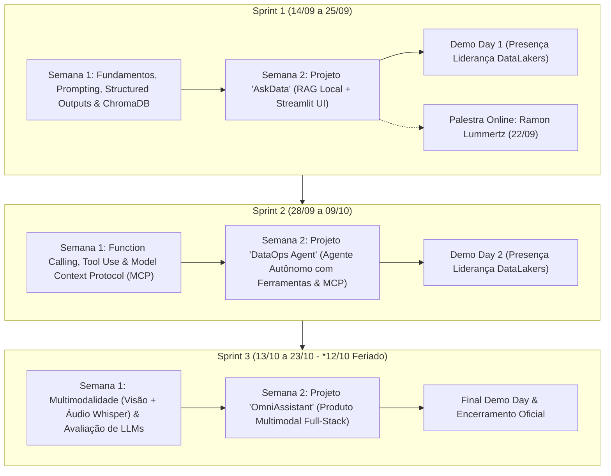

# 🧠 Grupo de Estudos em Inteligência Artificial Generativa
### Navi Hub (Tecnopuc) & DataLakers
**Período:** 14/09 a 23/10 | **Horário:** Segunda a Sexta, das 14h às 17h (3h/dia)  
**Carga Horária Total:** 90 horas presenciais (30 encontros) | **Público:** 15 alunos de Engenharia de Software e Sistemas de Informação da PUCRS (3º ao 5º semestre)

---

## 🎯 1. Visão Geral e Propósito
O Grupo de Estudos em Inteligência Artificial Generativa é uma iniciativa conjunta entre o **Navi Hub (Tecnopuc)** e a **DataLakers** focada no aprendizado autodirigido, prático e colaborativo:
1. **Autonomia & Aprendizado Ativo:** Os estudantes são os protagonistas da sua evolução técnica. O formato é baseado em roteiros diários detalhados, leituras padronizadas de referência e desafios práticos, sem aulas expositivas tradicionais.
2. **Captação de Talentos (Scouting):** A liderança da DataLakers estará presente nos momentos-chave (Abertura oficial, palestras de convidados e Demo Days ao final de cada Sprint) para avaliar proatividade, trabalho em equipe, qualidade de código e capacidade de entrega.
3. **Ambiente de Squads de Tecnologia:** Simulação da rotina de times modernos de engenharia de software (dinâmicas em duplas, desenvolvimento em trios, daily standups autônomas e entregas contínuas no GitHub).

---

## 🗓️ 2. Estrutura do Programa em 3 Sprints

O programa é dividido em **3 Sprints de 2 semanas cada**. Cada Sprint adota uma metodologia em duas fases:
* **Semana 1 (Fundamentação & Dinâmicas Práticas):** Leitura introdutória padronizada (10-15 min em plataformas de referência como *Cloudflare Learning Hub* e *PromptingGuide.ai*), tutoriais práticos guiados e desafios diários em duplas/trios.
* **Semana 2 (Desenvolvimento do Projeto da Sprint):** Desenvolvimento de um produto/serviço funcional de IA Generativa em trios, culminando em um **Demo Day com a presença da liderança da DataLakers**.

---

## 💻 3. Premissas Técnicas e Custo Zero (Sem Cartão de Crédito)

Todos os materiais, ferramentas e bibliotecas foram rigorosamente selecionados para garantir **100% de gratuidade e acessibilidade universal**, considerando que os alunos utilizarão seus próprios notebooks (Windows, macOS ou Linux, a partir de 8GB de RAM):

1. **APIs e Modelos Cloud Gratuitos:**
   - **Google AI Studio:** API key gratuita, sem necessidade de cartão de crédito e com limites generosos.
   - **Groq Cloud:** Inferência ultra-rápida gratuita sem cartão.
   - **Hugging Face Hub:** Acesso a modelos e datasets open-source.
2. **Execução Local (Offline/Edge):**
   - **Ollama:** Execução local de modelos leves (`llama3.2:1b/3b`, `qwen2.5-coder:1.5b/3b`, `phi3.5:3.8b`) para quem tiver hardware compatível.
   - **ChromaDB / FAISS:** Banco vetorial local in-memory e persistente em disco.
3. **Ambiente de Desenvolvimento:**
   - **VS Code:** Editor principal com terminal integrado e extensões Python.
   - **GitHub Copilot:** Acesso gratuito para estudantes universitários via [GitHub Student Developer Pack](https://education.github.com/pack).
   - **Python 3.11+ / venv:** Ambiente virtual isolado para gerenciamento de dependências.
   - **Streamlit:** Framework Python para interfaces web reativas e interativas.

---

## ⏰ 4. Estrutura Autônoma do Encontro Diário (3 Horas)

| Bloco | Duração | Semana de Aprendizado (Semana 1) | Semana de Projeto (Semana 2) |
| :--- | :--- | :--- | :--- |
| **1. Alinhamento & Leitura Base** | 25 min (14:00 - 14:25) | **Leitura Padronizada de Referência** (*Cloudflare / PromptingGuide*) | Daily Standup autônoma por trio (ontem, hoje, bloqueios) |
| **2. Imersão Prática Guiada** | 65 min (14:25 - 15:30) | Tutoriais interativos, análise de código e experimentos | Codificação em squad & desenvolvimento do backlog |
| **3. Intervalo & Conexão** | 15 min (15:30 - 15:45) | Coffee break, networking e descanso visual | Coffee break e alinhamento rápido entre squads |
| **4. Desafio Colaborativo** | 60 min (15:45 - 16:45) | Desafio prático "mão na massa" em duplas/trios | Codificação focada, integração e testes de estresse |
| **5. Fechamento & Git Sync** | 15 min (16:45 - 17:00) | Auto-avaliação, checagem de código e dúvidas | Commit/Push no GitHub e atualização do README |

---

## 📂 5. Navegação nas Sprints
- [Sprint 1: Fundamentos de GenAI, Prompting, Structured Outputs & RAG Local](file:///home/eduardo/facul/8_semestre/grupo_estudos_ia/sprint_1_fundamentos_rag/README.md)
- *Sprint 2: Em breve (Agentes Autônomos, Function Calling & MCP)*
- *Sprint 3: Em breve (Multimodalidade & GenAI Aplicada)*
