# 📅 Dia 06 (21/09 - Segunda-feira)
# 🚀 Kickoff do Projeto "AskData" & Arquitetura do Sistema RAG

**Sprint 1:** Fundamentos de GenAI, Prompting, Structured Outputs & RAG Local  
**Horário:** 14:00 às 17:00 (3 horas) | **Formato:** Presencial (Navi Hub / Tecnopuc)  
**Semana 2:** Início do Desenvolvimento do Projeto em Trios

---

## 🎯 1. Objetivos do Encontro
1. Fazer o kickoff oficial do projeto prático da Sprint 1: **"AskData - Assistente Inteligente de Base de Conhecimento Corporativa"**.
2. Definir o domínio de dados e corpus de documentos de cada um dos 5 trios.
3. Desenhar a arquitetura técnica completa do sistema RAG (Diagrama de Componentes e Fluxo de Dados).
4. Configurar o repositório Git colaborativo no GitHub com regras de branch, `.gitignore` seguro e divisão de tarefas no trio.

---

## ⏰ 2. Cronograma Minuto a Minuto

```
┌─────────────────┬────────────────────────────────────────────────────────┐
│ 14:00 - 14:25   │ Apresentação dos Requisitos & Critérios do Projeto     │
│ 14:25 - 15:15   │ Workshop de Arquitetura RAG: Do Dado Bruto à Resposta  │
│ 15:15 - 15:30   │ Setup do Repositório GitHub Colaborativo por Trio      │
│ 15:30 - 15:45   │ Coffee Break & Networking                              │
│ 15:45 - 16:45   │ Brainstorming de Domínio & Desenho da Arquitetura      │
│ 16:45 - 17:00   │ Daily Standup de Encerramento: Apresentação dos Planos │
└─────────────────┴────────────────────────────────────────────────────────┘
```

---

## 📋 3. Bloco 1: Escopo e Requisitos do Projeto "AskData" (14:00 - 14:25)

Cada trio de estudantes atuará como uma equipe de engenharia de software da DataLakers encarregada de construir um produto mínimo viável (MVP) de RAG.

### Requisitos Funcionais Obrigatórios:
1. **Ingestão de Múltiplos Arquivos:** O sistema deve suportar a leitura de documentos reais em PDF e/ou Markdown.
2. **Chunking Inteligente:** Divisão dos textos em blocos coerentes (ex: 500 a 800 caracteres com 10-20% de sobreposição/overlap) preservando metadados de origem (nome do arquivo e página).
3. **Armazenamento Vetorial Local:** Uso do **ChromaDB** persistido em disco para indexação semântica via embeddings do Google (`text-embedding-004`).
4. **Retrieval Preciso & Grounding:** Recuperação dos *Top-K* chunks mais relevantes e injeção controlada no prompt do Gemini 2.0 Flash.
5. **Anti-Alucinação Estrita:** Se a resposta não estiver nos documentos, o sistema deve recusar educadamente sem inventar fatos.
6. **Interface Gráfica com Streamlit:** Uma aplicação web limpa com histórico de chat e um painel lateral (*sidebar*) para visualizar os trechos/fontes recuperadas.

---

## 🏗️ 4. Bloco 2: Workshop de Arquitetura RAG (14:25 - 15:15)

O mentor desenhará e discutirá no quadro a arquitetura padrão da solução:

```mermaid
flowchart TD
    subgraph Ingestao["1. Pipeline de Ingestão (Offline/Upload)"]
        A["Documentos Brutos (PDF / MD)"] --> B["Extrator de Texto & Metadados"]
        B --> C["Chunking (500-800 chars + Overlap)"]
        C --> D["API Google Embeddings (text-embedding-004)"]
        D --> E["ChromaDB Local Persistente (./chroma_db)"]
    end

    subgraph Consulta["2. Pipeline de Consulta & Resposta (Online)"]
        F["Usuário (Streamlit UI)"] --> G["Query do Usuário"]
        G --> H["Geração do Embedding da Pergunta"]
        H --> I["Busca Vetorial Top-K no ChromaDB"]
        I --> J["Montagem do Prompt com Contexto & Delimitadores"]
        J --> K["Gemini 2.0 Flash (LLM Generator)"]
        K --> L["Resposta Formatada com Citações de Origem"]
        L --> F
    end
```



---

## 🛠️ 5. Bloco 3: Setup do Repositório Git do Trio (15:15 - 15:30)

Um integrante de cada trio criará o repositório no GitHub e adicionará os outros 2 colegas e o mentor como colaboradores:

### Estrutura de Pastas Padronizada:
```
askdata_trioX/
├── .env.example
├── .gitignore
├── README.md
├── requirements.txt
├── data/                  # Documentos brutos (PDFs, MDs)
├── chroma_db/             # Pasta ignorada no git com os vetores
├── src/
│   ├── __init__.py
│   ├── ingestion.py       # Leitura, chunking e indexação no ChromaDB
│   ├── rag_engine.py      # Busca vetorial e chamada à LLM com grounding
│   └── app.py             # Interface web com Streamlit
```

### Arquivo `.gitignore` Obrigatório:
```gitignore
.venv/
.env
chroma_db/
__pycache__/
*.pyc
.DS_Store
```

---

## 💡 6. Bloco 4: Brainstorming de Domínio & Planejamento (15:45 - 16:45)

Os trios escolherão o domínio de aplicação do seu *AskData*. Exemplos recomendados:
* **Opção 1:** *Assistente de Normas Acadêmicas & Matrícula da PUCRS* (PDFs de regulamentos da universidade).
* **Opção 2:** *Assistente de Documentação de Engenharia de Dados* (Manuais do Apache Airflow, DBT e Docker).
* **Opção 3:** *Assistente de Políticas Internas & Benefícios Corporativos da DataLakers* (Corpus simulado de RH e TI).
* **Opção 4:** *Assistente Jurídico/Normativo da LGPD* (PDF da Lei Geral de Proteção de Dados e diretrizes da ANPD).

### Papéis e Divisão no Trio:
- **Dev 1 (Data & Ingestion Lead):** Responsável por `ingestion.py` (leitura de arquivos, estratégia de chunking e persistência no ChromaDB).
- **Dev 2 (RAG & Prompt Lead):** Responsável por `rag_engine.py` (consulta vetorial, formulação do prompt blindado e integração com Gemini).
- **Dev 3 (UI & Integration Lead):** Responsável por `app.py` (interface Streamlit, gerenciamento de estado do chat e exibição de fontes).

---

## 🎤 7. Bloco 5: Daily Standup de Encerramento (16:45 - 17:00)

Cada trio terá 2 minutos para compartilhar com a sala:
1. Qual domínio e documentos escolheram?
2. Como dividiram as tarefas iniciais no GitHub?
3. O que pretendem ter funcionando ao final do Dia 07 (amanhã)?

### ✅ Critério de Conclusão do Dia 06:
- [x] Repositório Git criado no GitHub com `.gitignore` e colaboradores convidados.
- [x] Domínio e documentos de teste selecionados pelo trio.
- [x] Arquitetura RAG compreendida e papéis definidos no trio.
