# 📅 Dia 06 (21/09 - Segunda-feira)
# 🚀 Kickoff do Projeto "AskData", Coleta de Dados & Setup Colaborativo

**Sprint 1:** Fundamentos de GenAI, Google AI Studio, Prompting & RAG Local  
**Horário:** 14:00 às 17:00 (3 horas) | **Formato:** Presencial Autônomo (Navi Hub / Tecnopuc)  
**Semana 2:** Início do Desenvolvimento do Projeto em Trios  

---

## 🎯 1. Objetivos do Encontro
1. Iniciar oficialmente o projeto prático da Sprint 1: **"AskData - Assistente Inteligente de Base de Conhecimento"**.
2. Compreender a visão macro do fluxo de um sistema RAG (Retrieval-Augmented Generation).
3. Definir o domínio temático de cada trio e **pesquisar/coletar ativamente os documentos reais** (PDFs e Markdowns) que alimentarão o assistente.
4. Configurar o repositório colaborativo no GitHub com regras de branches, `.gitignore` e estrutura de pastas padronizada.
5. Estabelecer a dinâmica de trabalho em equipe: **Modelo Piloto/Copiloto Rotativo** (onde todos participam de todas as etapas e alternam a responsabilidade pelo código a cada dia).

---

## ⏰ 2. Cronograma Minuto a Minuto

```
┌─────────────────┬────────────────────────────────────────────────────────┐
│ 14:00 - 14:20   │ Leitura Padronizada de Referência: O que é RAG?        │
│ 14:20 - 14:35   │ Kickoff do AskData: Visão Geral do Fluxo e Entregáveis │
│ 14:35 - 15:30   │ Escolha do Domínio & Pesquisa e Coleta dos Documentos  │
│ 15:30 - 15:45   │ Coffee Break & Networking                              │
│ 15:45 - 16:30   │ Setup do Repositório GitHub & Carga dos Dados em data/ │
│ 16:30 - 16:45   │ Dinâmica do Trio: Modelo Piloto/Copiloto Rotativo      │
│ 16:45 - 17:00   │ Sincronização Final no GitHub & Checklist do Dia 06    │
└─────────────────┴────────────────────────────────────────────────────────┘
```

---

## 📖 3. Bloco 1: Leitura Padronizada de Referência (14:00 - 14:20)

Antes de iniciar os trabalhos práticos, cada estudante deve ler os artigos conceituais sobre RAG:

1. 📄 [Cloudflare: O que é RAG (Geração Aumentada de Recuperação)?](https://www.cloudflare.com/pt-br/learning/ai/retrieval-augmented-generation-rag/) — *A ponte entre modelos de linguagem e bases de dados privadas.*
2. 📄 [AWS: O que é RAG?](https://aws.amazon.com/pt/what-is/retrieval-augmented-generation/) — *Benefícios empresariais: redução de alucinações, atualização contínua de conhecimento sem re-treinar a LLM e controle de acesso.*

---

## 🧭 4. Bloco 2: Kickoff do AskData & Visão Geral do Fluxo (14:20 - 14:35)

O projeto **AskData** desafia cada trio a criar um assistente de IA capaz de responder a dúvidas técnicas ou regulatórias com base exclusivamente em uma coleção de documentos privados, citando a fonte e a página exata da resposta.

### O Fluxo que o Trio Construirá até o Demo Day:

```mermaid
flowchart TD
    subgraph Ingestao["1. Pipeline de Ingestão (Dia 07)"]
        A["Documentos Coletados (data/*.pdf e *.md)"] --> B["Extrator de Texto & Metadados"]
        B --> C["Chunking Estratégico (700 chars + 100 overlap)"]
        C --> D["Google Embeddings (gemini-embedding-001)"]
        D --> E["ChromaDB Local Persistente (./chroma_db)"]
    end

    subgraph Consulta["2. Pipeline RAG & Interface (Dias 08 e 09)"]
        F["Usuário (Streamlit UI)"] --> G["Pergunta em Linguagem Natural"]
        G --> H["Embedding da Pergunta"]
        H --> I["Busca Vetorial Top-K no ChromaDB"]
        I --> J["Prompt com Grounding & Delimitadores"]
        J --> K["Modelo Flash Gemini (gemini-3.8-flash)"]
        K --> L["Resposta Fundamentada com Citação de Páginas"]
        L --> F
    end
```



---

## 📚 5. Bloco 3: Escolha do Domínio & Coleta Ativa dos Documentos (14:35 - 15:30)

Neste bloco de 55 minutos, o trio deve definir o problema de negócio que deseja resolver e **pesquisar, selecionar e baixar entre 3 e 5 arquivos reais** (PDF ou Markdown) para compor a base de conhecimento do assistente.

### Critérios Importantes para Seleção dos Documentos:
* **Texto Selecionável:** Os arquivos PDF devem conter texto digital nativo (não utilize PDFs compostos por fotos/scans de documentos, pois exigem OCR).
* **Extensão Recomendada:** Escolha documentos que somem entre 15 e 60 páginas no total. Documentos muito curtos (1 página) não demonstram o valor da busca semântica; documentos gigantescos (livros de 500 páginas) demoram desnecessariamente para gerar embeddings na cota gratuita da API.
* **Conteúdo Rico em Fatos:** Manuais de procedimentos, regulamentos, termos de uso, documentações técnicas ou relatórios corporativos.

### Sugestões de Domínios Temáticos para Inspiração:
1. **Domínio Acadêmico & Regulatório da PUCRS:** Regulamentos de graduação, manuais de estágio e normas complementares da faculdade.
2. **Domínio de Engenharia de Dados & DevOps:** Documentações e tutoriais oficiais de ferramentas (Airflow, DBT, Docker, Git).
3. **Domínio Jurídico & Compliance Corporativo:** Guia da LGPD para desenvolvedores, termos de privacidade e políticas de segurança da informação.
4. **Domínio de Gestão de Pessoas & RH:** Políticas de trabalho remoto, benefícios corporativos, onboarding de novos colaboradores e código de conduta.

> **Meta do Bloco:** Às 15:30, o trio deve ter em mãos de 3 a 5 arquivos baixados e validados, prontos para serem adicionados ao projeto.

---

## 🛠️ 6. Bloco 4: Setup do Repositório Git & Carga dos Documentos (15:45 - 16:30)

Com os arquivos de dados selecionados, o trio configura o ambiente colaborativo no GitHub:

1. **Criação do Repositório no GitHub:**
   - Um integrante cria o repositório remoto (ex: `askdata-trioX`) e convida os outros dois como colaboradores com permissão de escrita.
2. **Clonagem Local:**
   - Todos os 3 integrantes clonam o repositório em suas máquinas locais.

### Estrutura de Pastas Padronizada:
```
askdata_trioX/
├── .env.example
├── .gitignore
├── README.md
├── requirements.txt
├── data/                  # PDFs e Markdowns coletados hoje
├── chroma_db/             # Pasta local do ChromaDB (ignorada no git)
├── src/
│   ├── __init__.py
│   ├── ingestion.py       # Pipeline de chunking e embeddings (Dia 07)
│   ├── rag_engine.py      # Busca vetorial e prompt grounding (Dia 08)
│   └── app.py             # Interface web com Streamlit (Dia 09)
```

### Arquivo `.gitignore` Obrigatório:
```gitignore
.venv/
.env
chroma_db/
__pycache__/
*.pyc
.DS_Store
```

3. **Carga Inicial dos Dados:**
   - Coloquem os arquivos coletados dentro da pasta `data/`.
   - Criem o `README.md` inicial informando os nomes dos integrantes e o domínio temático escolhido.
   - Subam essas alterações para a branch `main` e confirmem que todos os integrantes conseguem executar o pull e ver os arquivos na pasta `data/`.

---

## 👥 7. Bloco 5: Divisão de Tarefas — Modelo Piloto/Copiloto Rotativo (16:30 - 16:45)

Para garantir que **todos os integrantes participem de todos os processos** e aprendam o pipeline de IA de ponta a ponta, o trio adotará a dinâmica de **Mob Programming Rotativo**:

Em cada dia de desenvolvimento, um membro assume o papel de **Piloto (Driver)** — com as mãos no teclado codando —, enquanto os outros dois atuam ativamente como **Copilotos (Navigators)** — analisando a lógica, pesquisando parâmetros, inspecionando tracebacks e validando os resultados.

### Escala Definida do Trio:
* **Dia 07 (Ingestão, Chunking & ChromaDB):**
  * **Piloto:** Integrante A (digita e constrói `src/ingestion.py`).
  * **Copilotos:** Integrantes B e C (validam a extração de páginas do PDF, conferem a integridade dos metadados e analisam o tamanho dos chunks).
* **Dia 08 (RAG Engine & Grounding Anti-Alucinação):**
  * **Piloto:** Integrante B (digita e constrói `src/rag_engine.py`).
  * **Copilotos:** Integrantes A e C (elaboram perguntas de teste de stress, cenários fora de escopo e tentam quebrar o guardrail anti-alucinação).
* **Dia 09 (Interface Streamlit & Polimento):**
  * **Piloto:** Integrante C (digita e constrói `src/app.py`).
  * **Copilotos:** Integrantes A e B (testam a usabilidade do chat, verificam a sidebar de explicabilidade e estruturam o roteiro do pitch).
* **Dia 10 (Demo Day):**
  * **Trio Completo:** Todos os 3 integrantes apresentam juntos diante da banca avaliadora da DataLakers, dividindo a fala técnica, a demonstração ao vivo e as respostas no Q&A.

---

## 🏁 8. Bloco 6: Sincronização no GitHub & Checklist do Dia 06 (16:45 - 17:00)

Dediquem os 15 minutos finais para verificar que o repositório colaborativo está devidamente sincronizado entre as três máquinas:
- Todos os 3 integrantes clonaram o projeto e estão com o `.venv` configurado?
- A pasta `data/` contém os documentos selecionados e está sincronizada no GitHub?
- O arquivo `.env` com a `GEMINI_API_KEY` está criado nas máquinas locais e devidamente protegido pelo `.gitignore`?

> 💡 Se houver qualquer divergência de arquivos ou permissão no repositório, aproveitem para debugar em conjunto. Resolver problemas de ambiente e alinhamento faz parte do dia a dia da engenharia de software!

> 📌 **Lembrete Importante:** Amanhã (Dia 07), das 14:00 às 15:00, teremos a palestra online com **Ramon Lummertz**. Tragam fones de ouvido e estejam conectados pontualmente às 14:00!

### ✅ Checklist de Conclusão do Dia 06:
- [x] Leituras conceituais de RAG concluídas.
- [x] Domínio temático definido e documentos reais (3 a 5 arquivos) coletados e armazenados em `data/`.
- [x] Repositório GitHub criado com `.gitignore` e colaboradores configurados.
- [x] Escala do Modelo Piloto/Copiloto Rotativo definida para os Dias 07, 08 e 09.
