# 📅 Dia 06 (21/09 - Segunda-feira)
# 🚀 Kickoff do Projeto "AskData" & Arquitetura do Sistema RAG

**Sprint 1:** Fundamentos de GenAI, Prompting, Structured Outputs & RAG Local  
**Horário:** 14:00 às 17:00 (3 horas) | **Formato:** Presencial Autônomo (Navi Hub / Tecnopuc)  
**Semana 2:** Início do Desenvolvimento do Projeto em Trios

---

## 🎯 1. Objetivos do Encontro
1. Iniciar oficialmente o desenvolvimento do projeto prático da Sprint 1: **"AskData - Assistente Inteligente de Base de Conhecimento"**.
2. Compreender a arquitetura técnica de referência de um sistema RAG (Retrieval-Augmented Generation).
3. Selecionar o corpus de documentos e domínio de negócio que o trio irá indexar (documentações técnicas, manuais, regulamentos).
4. Configurar o repositório colaborativo no GitHub com regras de branch, `.gitignore` e divisão de tarefas no trio.

---

## ⏰ 2. Cronograma Minuto a Minuto

```
┌─────────────────┬────────────────────────────────────────────────────────┐
│ 14:00 - 14:25   │ Leitura Padronizada de Referência (Cloudflare/AWS RAG) │
│ 14:25 - 15:15   │ Alinhamento de Arquitetura RAG & Escopo do AskData     │
│ 15:15 - 15:30   │ Setup do Repositório GitHub Colaborativo no Trio       │
│ 15:30 - 15:45   │ Coffee Break & Networking                              │
│ 15:45 - 16:45   │ Escolha do Domínio, Coleta dos PDFs & Desenho do Fluxo │
│ 16:45 - 17:00   │ Daily Standup Autônoma entre os Trios                  │
└─────────────────┴────────────────────────────────────────────────────────┘
```

---

## 📖 3. Bloco 1: Leitura Padronizada de Referência (14:00 - 14:25)

Antes de iniciar o projeto, cada integrante deve ler os artigos conceituais sobre RAG:

1. 📄 [Cloudflare: O que é RAG (Geração Aumentada de Recuperação)?](https://www.cloudflare.com/pt-br/learning/ai/what-is-rag/) — *A ponte entre modelos de linguagem e bases de dados privadas.*
2. 📄 [AWS: O que é RAG?](https://aws.amazon.com/pt/what-is/retrieval-augmented-generation/) — *Benefícios empresariais: redução de alucinações, atualização contínua de conhecimento sem re-treinar a LLM e controle de acesso.*

---

## 🏗️ 4. Bloco 2: A Arquitetura de Referência do AskData (14:25 - 15:15)

O projeto do trio implementará o seguinte fluxo arquitetural:

```mermaid
flowchart TD
    subgraph Ingestao["1. Pipeline de Ingestão (Dia 07)"]
        A["Documentos Brutos (PDF / MD)"] --> B["Extrator de Texto & Metadados"]
        B --> C["Chunking Estratégico (700 chars + 100 overlap)"]
        C --> D["Google Embeddings (text-embedding-004)"]
        D --> E["ChromaDB Local Persistente (./chroma_db)"]
    end

    subgraph Consulta["2. Pipeline RAG & Interface (Dias 08 e 09)"]
        F["Usuário (Streamlit UI)"] --> G["Pergunta em Linguagem Natural"]
        G --> H["Embedding da Pergunta"]
        H --> I["Busca Vetorial Top-K no ChromaDB"]
        I --> J["Prompt com Grounding & Delimitadores"]
        J --> K["Gemini 2.0 Flash"]
        K --> L["Resposta com Citação de Páginas & Fontes"]
        L --> F
    end
```



---

## 🛠️ 5. Bloco 3: Setup do Repositório Git do Trio (15:15 - 15:30)

Um integrante do trio cria o repositório no GitHub e convida os outros dois colegas como colaboradores:

### Estrutura de Pastas Padronizada:
```
askdata_trioX/
├── .env.example
├── .gitignore
├── README.md
├── requirements.txt
├── data/                  # PDFs e Markdowns brutos
├── chroma_db/             # Pasta local do ChromaDB (ignorada no git)
├── src/
│   ├── __init__.py
│   ├── ingestion.py       # Leitura, chunking e indexação no ChromaDB
│   ├── rag_engine.py      # Busca vetorial e chamada à LLM com grounding
│   └── app.py             # Interface web com Streamlit
```

### Arquivo `.gitignore` Obrigatório:
```gitignore
.venv/
.env
chroma_db/
__pycache__/
*.pyc
.DS_Store
```

---

## 💡 6. Bloco 4: Domínio dos Dados & Divisão de Tarefas (15:45 - 16:45)

Os trios escolherão seu domínio temático. Exemplos recomendados:
* **Opção 1:** *Assistente de Normas Acadêmicas & Matrícula da PUCRS* (Regulamentos da faculdade em PDF).
* **Opção 2:** *Assistente de Documentação de Engenharia de Dados* (Manuais do Airflow, DBT e Docker).
* **Opção 3:** *Assistente de Políticas Internas da DataLakers* (Políticas simuladas de RH, Segurança e TI).
* **Opção 4:** *Assistente Jurídico/Normativo da LGPD* (PDF da Lei Geral de Proteção de Dados).

### Divisão Sugerida de Papéis no Trio:
- **Dev 1 (Data & Ingestion Lead):** Foco em `src/ingestion.py` (extração de PDFs, chunking e ChromaDB).
- **Dev 2 (RAG Engine & Prompt Lead):** Foco em `src/rag_engine.py` (recuperação top-k, prompt de grounding e Gemini).
- **Dev 3 (UI & Integration Lead):** Foco em `src/app.py` (Streamlit, sidebar de fontes e testes).

---

## 🎤 7. Bloco 5: Daily Standup Autônoma (16:45 - 17:00)

Reúnam-se brevemente com os outros trios para compartilhar:
1. Qual domínio e conjunto de documentos o trio escolheu?
2. O repositório no GitHub está configurado com todos os membros?

> 📌 **Lembrete Especial:** Amanhã (Dia 07), das 14:00 às 15:00, teremos a palestra online com **Ramon Lummertz**. Tragam fones de ouvido e estejam conectados pontualmente às 14:00!

### ✅ Checklist de Conclusão do Dia 06:
- [x] Leituras conceituais de RAG concluídas.
- [x] Repositório Git criado no GitHub com `.gitignore` e colaboradores convidados.
- [x] Domínio e documentos selecionados pelo trio.
- [x] Divisão de responsabilidades definida.
