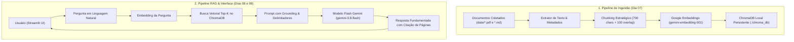

# 📅 Dia 06 (21/09 - Segunda-feira)
# 🚀 Kickoff do Projeto "AskData", Coleta de Dados & Setup Colaborativo

**Sprint 1:** Fundamentos de GenAI, Google AI Studio, Prompting & RAG Local  
**Horário:** 14:00 às 17:00 (3 horas) | **Formato:** Presencial Autônomo (Navi Hub / Tecnopuc)  
**Semana 2:** Início do Desenvolvimento do Projeto em Trios  

---

## 🎯 1. Objetivos do Encontro
1. Iniciar oficialmente o projeto prático da Sprint 1: **"AskData - Assistente Inteligente de Base de Conhecimento"**.
2. Compreender a visão macro do fluxo de um sistema RAG (Retrieval-Augmented Generation).
3. Definir o domínio temático de cada trio e **pesquisar/coletar ativamente os documentos reais** (PDFs e Markdowns) que alimentarão o assistente.
4. Validar o conceito do projeto entre os times através do **Pitch Relâmpago de 1 Minuto**.
5. Configurar o repositório colaborativo no GitHub e validar o ambiente de desenvolvimento de todos com o **Smoke Test do Trio** (`check_setup.py`).
6. Estabelecer a dinâmica de trabalho em equipe: **Modelo Piloto/Copiloto Rotativo** (onde todos participam de todas as etapas e alternam a responsabilidade pelo código a cada dia).
7. Consolidar os conceitos arquiteturais e operacionais através do **Quiz Interativo de Fixação**.

---

## ⏰ 2. Cronograma Minuto a Minuto

```
┌─────────────────┬────────────────────────────────────────────────────────┐
│ 14:00 - 14:20   │ Leitura Padronizada de Referência: O que é RAG?        │
│ 14:20 - 14:35   │ Kickoff do AskData: Visão Geral do Fluxo e Entregáveis │
│ 14:35 - 15:30   │ Coleta dos Documentos & Pitch Relâmpago de 1 Minuto    │
│ 15:30 - 15:45   │ Coffee Break & Networking                              │
│ 15:45 - 16:25   │ Setup do GitHub & Smoke Test do Trio (check_setup.py)  │
│ 16:25 - 16:35   │ Dinâmica do Trio: Modelo Piloto/Copiloto Rotativo      │
│ 16:35 - 16:45   │ Quiz Interativo de Fixação (quizzes/quiz_dia_06.html)  │
│ 16:45 - 17:00   │ Formulário de Auto-Avaliação & Feedback (Google Forms) │
└─────────────────┴────────────────────────────────────────────────────────┘
```

---

## 📖 3. Bloco 1: Leitura Padronizada de Referência (14:00 - 14:20)

Antes de iniciar os trabalhos práticos, cada estudante deve ler os artigos conceituais sobre RAG:

1. 📄 [Cloudflare: O que é RAG (Geração Aumentada de Recuperação)?](https://www.cloudflare.com/pt-br/learning/ai/retrieval-augmented-generation-rag/) — *A ponte entre modelos de linguagem e bases de dados privadas.*
2. 📄 [AWS: O que é RAG?](https://aws.amazon.com/pt/what-is/retrieval-augmented-generation/) — *Benefícios empresariais: redução de alucinações, atualização contínua de conhecimento sem re-treinar a LLM e controle de acesso.*

---

## 🧭 4. Bloco 2: Kickoff do AskData & Visão Geral do Fluxo (14:20 - 14:35)

O projeto **AskData** desafia cada trio a criar um assistente de IA capaz de responder a dúvidas técnicas ou regulatórias com base exclusivamente em uma coleção de documentos privados, citando a fonte e a página exata da resposta.

### O Fluxo que o Trio Construirá até o Demo Day:


```mermaid
flowchart TD
    subgraph Ingestao["1. Pipeline de Ingestão (Dia 07)"]
        A["Documentos Coletados (data/*.pdf e *.md)"] --> B["Extrator de Texto & Metadados"]
        B --> C["Chunking Estratégico (700 chars + 100 overlap)"]
        C --> D["Google Embeddings (gemini-embedding-001)"]
        D --> E["ChromaDB Local Persistente (./chroma_db)"]
    end

    subgraph Consulta["2. Pipeline RAG & Interface (Dias 08 e 09)"]
        F["Usuário (Streamlit UI)"] --> G["Pergunta em Linguagem Natural"]
        G --> H["Embedding da Pergunta"]
        H --> I["Busca Vetorial Top-K no ChromaDB"]
        I --> J["Prompt com Grounding & Delimitadores"]
        J --> K["Modelo Flash Gemini (gemini-3.8-flash)"]
        K --> L["Resposta Fundamentada com Citação de Páginas"]
        L --> F
    end
```

---

## 📚 5. Bloco 3: Escolha do Domínio, Coleta de Documentos & Pitch Relâmpago (14:35 - 15:30)

Neste bloco, o trio deve definir o problema de negócio que deseja resolver, **pesquisar, selecionar e baixar entre 3 e 5 arquivos reais** (PDFs) para compor a base de conhecimento e validar a viabilidade com um trio parceiro.

### Critérios Importantes para Seleção dos Documentos:
* **Texto Selecionável:** Os arquivos PDF devem conter texto digital nativo (não utilize PDFs compostos por fotos/scans de documentos, pois exigem OCR).
* **Extensão Recomendada:** Escolha documentos que somem entre 15 e 60 páginas no total. Documentos muito curtos (1 página) não demonstram o valor da busca semântica; documentos gigantescos (livros de 500 páginas) demoram desnecessariamente para gerar embeddings na cota gratuita da API.
* **Conteúdo Rico em Fatos:** Manuais de procedimentos, regulamentos, termos de uso, documentações técnicas ou relatórios corporativos.

### Sugestões de Domínios Temáticos para Inspiração:
1. **Domínio Acadêmico & Regulatório da PUCRS:** Regulamentos de graduação, manuais de estágio e normas complementares da faculdade.
2. **Domínio de Engenharia de Dados & DevOps:** Documentações e tutoriais oficiais de ferramentas (Airflow, DBT, Docker, Git).
3. **Domínio Jurídico & Compliance Corporativo:** Guia da LGPD para desenvolvedores, termos de privacidade e políticas de segurança da informação.
4. **Domínio de Gestão de Pessoas & RH:** Políticas de trabalho remoto, benefícios corporativos, onboarding de novos colaboradores e código de conduta.

### ⚡ Dinâmica: Pitch Relâmpago de 1 Minuto (15:20 - 15:30)
Assim que o trio fechar a coleta dos arquivos, realizem uma rodada de alinhamento rápido com um trio vizinho:
1. **Pitch de 60 Segundos:** Um integrante apresenta o conceito do AskData do seu time: qual problema resolve, quais são os documentos coletados e por que o volume/conteúdo é adequado para RAG.
2. **Feedback Cruzado (60 Segundos):** O trio ouvinte fornece 1 sugestão objetiva (ex: atenção à legibilidade do PDF, cobertura de tópicos ou escopo das perguntas).
3. **Inversão:** O trio vizinho apresenta seu pitch e recebe o retorno.

> **Meta do Bloco:** Às 15:30, o trio deve ter em mãos de 3 a 5 arquivos baixados, validados e aprovados no Pitch Relâmpago, prontos para a carga no repositório.

---

## 🛠️ 6. Bloco 4: Setup do Repositório Git & Smoke Test do Trio (15:45 - 16:25)

Com os arquivos de dados selecionados, o trio configura o ambiente colaborativo no GitHub e valida as máquinas locais:

1. **Criação do Repositório no GitHub:**
   - Um integrante cria o repositório remoto (ex: `askdata-trioX`) e convida os outros dois como colaboradores com permissão de escrita.
2. **Clonagem Local:**
   - Todos os 3 integrantes clonam o repositório em suas máquinas locais.

### Estrutura de Pastas Padronizada:
```
askdata_trioX/
├── .env.example
├── .gitignore
├── README.md
├── requirements.txt
├── check_setup.py         # Script de Smoke Test executado hoje
├── data/                  # PDFs e Markdowns coletados hoje
├── chroma_db/             # Pasta local do ChromaDB (ignorada no git)
├── src/
│   ├── __init__.py
│   ├── ingestion.py       # Pipeline de chunking e embeddings (Dia 07)
│   ├── rag_engine.py      # Busca vetorial e prompt grounding (Dia 08)
│   └── app.py             # Interface web com Streamlit (Dia 09)
```

### Arquivo `.gitignore` Obrigatório:
```gitignore
.venv/
.env
chroma_db/
__pycache__/
*.pyc
.DS_Store
```

3. **Carga Inicial dos Dados:**
   - Coloquem os arquivos coletados dentro da pasta `data/`.
   - Criem o `README.md` inicial informando os nomes dos integrantes e o domínio temático escolhido.
   - Subam essas alterações para a branch `main` e confirmem que todos os integrantes conseguem executar o pull e ver os arquivos na pasta `data/`.

### 🧪 Smoke Test do Trio (`check_setup.py`)

Para assegurar que nenhuma máquina do trio chegue ao Dia 07 com ambiente inconsistente, variáveis ausentes ou PDFs com problemas de leitura, criem na raiz do projeto o arquivo `check_setup.py`:

```python
import os
import sys
from pathlib import Path
from dotenv import load_dotenv

def test_imports():
    print("[1/3] Testando imports de bibliotecas essenciais...")
    modules = ["google.genai", "chromadb", "pypdf", "dotenv"]
    all_ok = True
    for mod in modules:
        try:
            __import__(mod)
            print(f"  [OK] Modulo '{mod}' importado com sucesso.")
        except ImportError as e:
            print(f"  [FALHA] Nao foi possivel importar '{mod}': {e}")
            all_ok = False
    return all_ok

def test_api_key():
    print("\n[2/3] Verificando chave de API...")
    load_dotenv()
    api_key = os.getenv("GEMINI_API_KEY")
    if not api_key:
        print("  [FALHA] Variavel GEMINI_API_KEY nao encontrada no .env ou ambiente.")
        return False
    
    mascarada = api_key[:4] + "..." + api_key[-4:] if len(api_key) > 8 else "***"
    print(f"  [OK] GEMINI_API_KEY configurada ({mascarada}).")
    return True

def test_data_folder():
    print("\n[3/3] Validando documentos na pasta data/...")
    data_dir = Path("data")
    if not data_dir.exists() or not data_dir.is_dir():
        print("  [FALHA] Diretorio 'data/' nao encontrado.")
        return False
    
    files = [f for f in data_dir.iterdir() if not f.name.startswith(".")]
    if not files:
        print("  [AVISO] Nenhum arquivo encontrado dentro de 'data/'.")
        return False

    import pypdf
    pdf_count = 0
    total_pages = 0

    for file_path in sorted(files):
        if file_path.suffix.lower() == ".pdf":
            pdf_count += 1
            try:
                reader = pypdf.PdfReader(str(file_path))
                pages = len(reader.pages)
                total_pages += pages
                print(f"  [OK] PDF: {file_path.name} - {pages} paginas.")
            except Exception as e:
                print(f"  [FALHA] Erro ao ler {file_path.name}: {e}")
        elif file_path.suffix.lower() in [".md", ".txt"]:
            print(f"  [OK] Documento de texto: {file_path.name}")
        else:
            print(f"  [INFO] Outro arquivo: {file_path.name}")

    print(f"\nResumo: {pdf_count} PDFs validados, totalizando {total_pages} paginas.")
    if pdf_count < 3 or pdf_count > 5:
        print(f"  [AVISO] O trio deve ter entre 3 e 5 arquivos PDF (atualmente: {pdf_count}).")
    return True

if __name__ == "__main__":
    print("=== SMOKE TEST DO TRIO (AskData) ===")
    ok_imports = test_imports()
    ok_key = test_api_key()
    ok_data = test_data_folder()

    if ok_imports and ok_key and ok_data:
        print("\n[SUCESSO] Ambiente validado com sucesso em todos os requisitos!")
        sys.exit(0)
    else:
        print("\n[ERRO] Ajuste as pendencias acima antes de avancar.")
        sys.exit(1)
```

**Validação em Equipe:**
1. Cada integrante do trio executa o script localmente no terminal:
   ```bash
   python check_setup.py
   ```
2. Confirmem que todos obtêm a mensagem de sucesso e que a contagem de PDFs e páginas coincide.
3. Adicionem e subam o `check_setup.py` no GitHub para manter o teste padronizado no repositório.

---

## 👥 7. Bloco 5: Divisão de Tarefas — Modelo Piloto/Copiloto Rotativo (16:25 - 16:35)

Para garantir que **todos os integrantes participem de todos os processos** e aprendam o pipeline de IA de ponta a ponta, o trio adotará a dinâmica de **Mob Programming Rotativo**:

Em cada dia de desenvolvimento, um membro assume o papel de **Piloto (Driver)** — com as mãos no teclado codando —, enquanto os outros dois atuam ativamente como **Copilotos (Navigators)** — analisando a lógica, pesquisando parâmetros, inspecionando tracebacks e validando os resultados.

### Escala Definida do Trio:
* **Dia 07 (Ingestão, Chunking & ChromaDB):**
  * **Piloto:** Integrante A (digita e constrói `src/ingestion.py`).
  * **Copilotos:** Integrantes B e C (validam a extração de páginas do PDF, conferem a integridade dos metadados e analisam o tamanho dos chunks).
* **Dia 08 (RAG Engine & Grounding Anti-Alucinação):**
  * **Piloto:** Integrante B (digita e constrói `src/rag_engine.py`).
  * **Copilotos:** Integrantes A e C (elaboram perguntas de teste de stress, cenários fora de escopo e tentam quebrar o guardrail anti-alucinação).
* **Dia 09 (Interface Streamlit & Polimento):**
  * **Piloto:** Integrante C (digita e constrói `src/app.py`).
  * **Copilotos:** Integrantes A e B (testam a usabilidade do chat, verificam a sidebar de explicabilidade e estruturam o roteiro do pitch).
* **Dia 10 (Demo Day):**
  * **Trio Completo:** Todos os 3 integrantes apresentam juntos diante da banca avaliadora da DataLakers, dividindo a fala técnica, a demonstração ao vivo e as respostas no Q&A.

---

## 🧠 8. Bloco 6: Quiz Interativo de Fixação (16:35 - 16:45)

Antes do fechamento do encontro, cada participante deve realizar individualmente o quiz interativo do dia:

1. Abra o arquivo [`quizzes/quiz_dia_06.html`](quizzes/quiz_dia_06.html) no navegador (dê duplo clique ou abra diretamente pelo VS Code / terminal).
2. Responda às 15 perguntas dinâmicas (verdadeiro/falso, múltipla escolha, completar a palavra, ordenação e associação) cobrindo:
   - Papéis dos componentes RAG (Embeddings, Vetorização, ChromaDB, Prompt Grounding e LLM).
   - Critérios de qualidade para documentos-fonte (texto nativo vs OCR, extensão e densidade factual).
   - Boas práticas no Git (`.gitignore`, isolamento do `.env`, não versionamento do banco binário local).
   - Princípios da rotação Piloto/Copiloto e comunicação no trio.
3. A pontuação e o feedback explicativo aparecem na hora.
4. Compartilhem com o trio as dúvidas ou pontos que geraram debate.

---

## 📝 9. Bloco 7: Formulário Diário de Auto-Avaliação & Feedback (16:45 - 17:00)

> 📋 **Link do Formulário de Auto-Avaliação:**  
> [Preencher Formulário do Google Forms - Dia 06](https://docs.google.com/forms/d/e/1FAIpQLSfwAa5BJ5wnaXSQ8hABOF5eX5sZCy7yjsPjy_cso6XwPcAigQ/viewform)

> 📌 **Lembrete Importante:** Amanhã (Dia 07), das 14:00 às 15:00, teremos a palestra online com **Ramon Lummertz**. Tragam fones de ouvido e estejam conectados pontualmente às 14:00!

### ✅ Checklist de Conclusão do Dia 06:
- [x] Leituras conceituais de RAG concluídas.
- [x] Domínio temático definido e documentos reais (3 a 5 arquivos) coletados e armazenados em `data/`.
- [x] "Pitch Relâmpago de 1 Minuto" realizado com trio vizinho e feedback registrado.
- [x] Repositório GitHub criado com `.gitignore` e colaboradores configurados.
- [x] "Smoke Test do Trio" (`check_setup.py`) executado e validado na máquina de cada integrante.
- [x] Escala do Modelo Piloto/Copiloto Rotativo definida para os Dias 07, 08 e 09.
- [x] Quiz interativo de fixação ([`quizzes/quiz_dia_06.html`](quizzes/quiz_dia_06.html)) concluído.
- [x] Formulário de auto-avaliação e feedback preenchido no Google Forms.
- [ ] (Atividades Complementares) Vídeo de Git assistido e/ou Contrato de Trabalho do Trio documentado no `README.md`.

---

## 🎁 Atividades Complementares

1. 🎥 **Vídeo:** [Fireship — "Git Explained in 100 Seconds"](https://www.youtube.com/watch?v=hwP7WQkmECE). Uma revisão ágil e visual dos comandos fundamentais e mecânica de branches do Git.
2. 💻 **Código / Documento Bônus — "Contrato de Trabalho do Trio":**  
   Estruturem uma seção no `README.md` do repositório com os acordos de trabalho do trio:
   - **Comunicação:** canal de alinhamento assíncrono (ex: WhatsApp, Discord) e aviso prévio em caso de imprevistos.
   - **Resolução de Impasses:** regra prática quando houver dúvidas de código (ex: pesquisar/debater por 10 minutos antes de acionar o monitor).
   - **Compromisso de Rotação:** validação da escala de Piloto e Copiloto para que todos os membros pratiquem hands-on.
