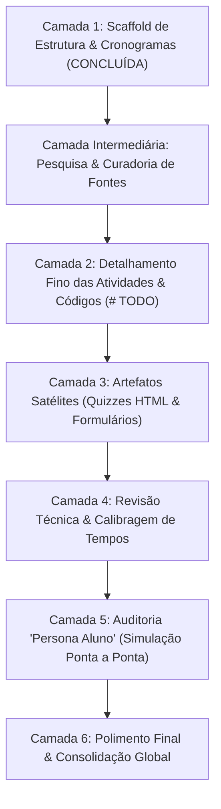

# 📘 Guia de Execução & Contexto para a Equipe e Agentes de IA
# 🚀 Continuação e Detalhamento da Sprint 2: Agentes Autônomos, Function Calling & MCP

**Destinatários:** Membros da equipe organizadora e seus respectivos Agentes Autônomos de IA.  
**Repositório:** `grupo-de-estudos-ia`  
**Escopo de Atuação:** `sprint_2_agentes/`  
**Público-Alvo Final:** 15 estudantes universitários (3º ao 5º semestre de Engenharia de Software, Ciência e Sistemas de Informação da PUCRS).

---

## 🎯 1. Visão Geral & Filosofia Pedagógica

Este repositório hospeda o conteúdo de um **Grupo de Estudos de Inteligência Artificial Generativa Aplicada**, realizado em parceria entre o **Navi Hub (Tecnopuc)** e a empresa **DataLakers**.

### 🌟 A Regra de Ouro: Autonomia Estudantil
O grupo de estudos é **100% autônomo e autodirigido**:
- **Não há mentores em sala ministrando aulas expositivas ou coordenando atividades em tempo integral.**
- Os materiais markdown de cada dia (`dia_11_*.md` a `dia_20_*.md`) devem ser **o próprio mentor do aluno**: textos claros, instruções de cronômetro, objetivos transparentes e comandos diretos para as duplas e trios.
- **A experiência do estudante é a prioridade absoluta.** Se uma instrução for confusa, se faltar contexto para preencher um trecho de código, ou se um conceito for assumido como óbvio sem introdução prévia, o aluno ficará travado e desmotivado.

### 🌉 O Salto da Sprint 1 para a Sprint 2
- **Sprint 1 (Concluída):** Foco em *leitura e fundamentação documental* através de RAG (Retrieval-Augmented Generation), ChromaDB e embeddings vetoriais.
- **Sprint 2 (Atual):** Os modelos deixam de apenas responder perguntas e passam a **agir no mundo real** por meio de:
  1. Saídas Estruturadas com contratos formais (Pydantic & JSON Schemas).
  2. Chamada de Ferramentas nativas (*Function Calling*).
  3. Loops de raciocínio e execução autônoma multi-turno (*Padrão ReAct*).
  4. Padrão aberto de ferramentas: **Model Context Protocol (MCP)** via transporte `stdio`.
  5. Projeto Cumulativo da Semana 2: **"DataOps Agent"** — um agente local em SQLite protegido por guardrails determinísticos de SQL, com interface visual em Streamlit e gaveta de explicabilidade de ferramentas.

---

## ⚖️ 2. Rigores Técnicos Inegociáveis (Constituição da Sprint 2)

Qualquer agente de IA ou desenvolvedor humano que atuar na Sprint 2 **DEVE OBEDECER RIGOROSAMENTE** às seguintes diretrizes:

### 1. Custo Zero & Sem Cartão de Crédito
- **Todas as ferramentas, plataformas, APIs e bibliotecas DEVEM ser 100% gratuitas**, sem necessidade de cadastro de cartão de crédito.
- É estritamente proibido propor o uso de ferramentas pagas ou APIs que exijam faturamento corporativo.

### 2. Modelo Oficial de IA
- O modelo oficial adotado é o **`gemini-3.8-flash`** (Google AI Studio).
- Utilizar a biblioteca oficial moderna em Python: `from google import genai` e `from google.genai import types` (pacote `google-genai`).
- Chaves de API ficam estritamente isoladas no arquivo `.env` (`GEMINI_API_KEY=...`) e carregadas via `python-dotenv`.

### 3. Banco de Dados Local Plug-and-Play
- O banco de dados relacional do projeto *DataOps Agent* é exclusivamente o **SQLite nativo do Python** (`import sqlite3`).
- Salvo localmente em `data/dataops.db`.
- **Zero instalação de infraestrutura:** Não utilizar Docker, PostgreSQL, MySQL ou serviços de cloud para o banco. A experiência precisa ser imediata e sem atrito em qualquer sistema operacional (Linux, macOS ou Windows).

### 4. Protocolo de Ferramentas (MCP)
- Utilizar a biblioteca oficial em Python do **Model Context Protocol**: `mcp` e o framework de alto nível **`FastMCP`**.
- O transporte de comunicação inter-processos deve ser exclusivamente **`stdio`** (standard input/output), garantindo segurança local sem necessidade de abrir portas de rede ou gerenciar servidores HTTP.

### 5. Frontend & Explicabilidade
- A interface gráfica é construída em **Streamlit** (`app.py`, rodando em `localhost:8501`).
- Deve conter obrigatoriamente um painel expansível (*Tool Execution Trace Drawer*) mostrando a rastreabilidade total de cada chamada: ferramenta invocada, query SQL gerada, validação do guardrail e tempo de resposta.

### 6. Código Limpo: ZERO Emojis em Blocos de Código
- **Proibido inserir emojis dentro de blocos de código** (Python, Bash, SQL, JSON).
- Emojis são permitidos e incentivados apenas na narrativa dos arquivos markdown, tabelas e títulos para apelo visual.

### 7. Atividades Complementares: Sem a Palavra "Opcional"
- Todo dia encerra com exatamente **2 Atividades Complementares**:
  1. 🎥 **Vídeo:** 1 link para vídeo no YouTube/palestra de alta autoridade técnica (para estudantes com fones).
  2. 💻 **Código Bônus / Desafio Extra:** 1 script avançado para enriquecimento técnico.
- **NUNCA usar a palavra "opcional"** nem criar avisos como *"se sobrar tempo, você pode fazer..."*. As atividades devem ser tratadas como conteúdo complementar valioso.

### 8. Padrão de Amostra de Código com Trechos para Completar (`# TODO`)
- Ao especificar atividades de programação, **NÃO forneça o código 100% pronto** (para evitar o hábito de apenas copiar e colar sem pensar).
- **NÃO deixe instruções no vácuo** sem código base (para evitar travamento de alunos com pouca experiência em Python).
- **Forneça sempre um scaffold/esqueleto com código funcional e trechos demarcados com `# TODO:`**, indicando claramente qual lógica, regra de negócio ou função o estudante deve implementar.

### 9. Versionamento & Segurança Git
- **Nunca executar `git commit` ou `git push`** de forma autônoma sem autorização expressa do usuário humano.
- O arquivo `.env` deve constar obrigatoriamente no `.gitignore`.

---

## ⏰ 3. Gestão do Tempo e Prevenção de Saídas Antecipadas

Um dos maiores problemas identificados nas primeiras semanas foi a **saída antecipada de estudantes que terminavam atividades rápido demais**. Para resolver isso:

1. **Seja Crítico e Realista com o Tempo:**
   - Atividades que levam 25 minutos **não podem ter 1 hora reservada**.
   - O tempo de cada encontro (14:00 às 17:00 = 180 minutos) deve ser preenchido com múltiplos blocos dinâmicos e desafiadores.
2. **Semana 1 vs. Semana 2:**
   - **Semana 1 (Dias 11 a 15):** Atividades em duplas, exploratórias e ricas em desafios gamificados, testes de estresse, benchmarks e depuração de erros.
   - **Semana 2 (Dias 16 a 19):** Atividades em trios (Piloto/Copilotos), **100% conectadas ao desenvolvimento cumulativo do *DataOps Agent***, já que os estudantes não trabalharão no projeto em casa.
3. **Estrutura Temporal Padronizada:**
   - `14:00 - 14:05` (5 min): **Daily Standup de Abertura** obrigatória em pé:
     ```
     1. 🌟 O QUE MAIS GOSTEI: O que mais curti aprender/explorar no encontro anterior?
     2. 🚧 MINHA MAIOR DIFICULDADE: Onde mais me bati, qual bug enfrentei ou qual dúvida ficou?
     ```
   - `14:05 - 14:20` (15 min): Leitura Padronizada de Referência.
   - `14:20 - 15:30`: Blocos de Desenvolvimento Prático (fatiados em etapas de 20 a 40 minutos).
   - `15:30 - 15:45` (15 min): Coffee Break & Networking.
   - `15:45 - 16:25`: Blocos de Desafio, Testes Adversariais e Integração.
   - `16:25 - 16:35` (10 min): Sincronização no GitHub (Git Sync).
   - `16:35 - 16:45` (10 min): Quiz Interativo Local (`quizzes/quiz_dia_XX.html`).
   - `16:45 - 17:00` (15 min): Formulário Diário de Auto-Avaliação & Feedback (Google Forms).

---

## 🪜 4. O Fluxo Procedural em Camadas (Step-by-Step)

A expansão e finalização da Sprint 2 **deve ser executada em camadas sequenciais e procedurais**. Os agentes de IA dos colegas devem pausar ao final de cada camada e solicitar revisão e feedback humano antes de prosseguir.



---

### 🟢 Camada 1: Scaffold de Estrutura & Cronogramas [STATUS: CONCLUÍDA]
- Todos os 10 arquivos (`dia_11_*.md` a `dia_20_*.md`) e o `sprint_2_agentes/README.md` foram criados com cabeçalhos padronizados da Sprint 1, cronogramas minuto a minuto densos e realistas, e marcadores `<!-- CAMADA 2: ... -->`.

---

### 🔍 Camada Intermediária: Pesquisa & Curadoria de Fontes de Alta Autoridade
**Objetivo:** Antes de escrever código ou teoria nos arquivos, o agente deve pesquisar uma quantidade expressiva de materiais confiáveis para cada dia e decidir criteriosamente o que entra e o que não entra.

**Instruções para o Agente:**
1. Pesquisar documentações oficiais (Google GenAI Docs, Model Context Protocol Specification, FastMCP docs, SQLite docs, Streamlit docs) e artigos técnicos de referência (DAIR.AI, Cloudflare Learning Hub, papers do ReAct).
2. **Critérios de Inclusão:**
   - Clareza conceitual e acessibilidade para estudantes de 3º ao 5º semestre.
   - Gratuidade total e ausência de paywalls.
   - Alinhamento estrito com `gemini-3.8-flash` e bibliotecas em Python moderno.
3. **Critérios de Exclusão:**
   - Materiais desatualizados que utilizem bibliotecas legadas (como o antigo `google-generativeai` em vez de `google-genai`).
   - Frameworks caixa-preta pesados que escondem a mecânica dos agentes (LangChain/CrewAI) — nesta sprint, construímos a orquestração do zero com Python puro e FastMCP!
4. **Entregável:** Tabela de curadoria com as fontes selecionadas, links exatos e justificativa de escolha para aprovação humana.

---

### ✍️ Camada 2: Detalhamento Fino das Atividades & Códigos
**Objetivo:** Substituir cada placeholder `<!-- CAMADA 2: ... -->` pelo conteúdo didático e prático definitivo.

**Instruções para o Agente:**
1. **Leitura Padronizada de Referência:**
   - Redigir texto conceitual objetivo e engajador (3 a 5 parágrafos bem diagramados).
   - Incluir links das fontes curadas na Camada Intermediária.
2. **Blocos de Atividade Prática:**
   - Transformar as descrições em roteiros práticos passo a passo.
   - Fornecer os scripts esqueleto em Python com comentários explicativos e blocos `# TODO: Implemente aqui...`.
   - Garantir que cada exercício tenha critérios de sucesso claros (ex: *"A saída esperada no terminal deve ser..."*).
3. **Trabalho Colaborativo:**
   - Indicar claramente a dinâmica: em duplas (Semana 1) ou trios com Piloto/Copilotos e rotação diária (Semana 2).
4. **Atividades Complementares:**
   - Preencher o link real do vídeo recomendado e o código bônus funcional.

---

### 🧩 Camada 3: Criação de Artefatos Satélites (Quizzes & Formulários)

#### A. Quizzes Interativos HTML (`sprint_2_agentes/quizzes/`)
1. **Estrutura & Design:**
   - Os quizzes devem seguir rigorosamente o padrão visual e arquitetural dos quizzes da Sprint 1 (`sprint_1_fundamentos_rag/quizzes/`).
   - Devem utilizar os mesmos arquivos de estilo e lógica: `quiz.css` e `quiz.js` (copiar para `sprint_2_agentes/quizzes/`).
2. **Arquivos a Criar:**
   - `quiz_dia_11.html` a `quiz_dia_20.html`.
3. **Qualidade Pedagógica:**
   - Cada quiz deve conter entre **10 e 15 questões** cobrindo conceitos teóricos e armadilhas práticas de código do dia.
   - Formatos aceitos: Múltipla Escolha (`tipo: "multipla"`), Verdadeiro ou Falso (`tipo: "vf"`) e Preenchimento de Lacunas (`tipo: "completar"`).
   - **Gabarito comentado obrigatório:** Todas as alternativas (corretas e incorretas) devem trazer a explicação do porquê estão certas ou erradas.

#### B. Formulários da Sprint 2 (Google Forms)
1. **Referência Documental:**
   - Consultar o arquivo `sprint_1_fundamentos_rag/formularios/README.md` como modelo de especificação dos formulários (identificação via e-mail PUCRS, auto-avaliação, escala 1-5 e feedback do dia).
2. **Formulários Necessários para a Sprint 2:**
   - *Formulário 1:* Dia 11 — Expectativas & Auto-Avaliação Inicial da Sprint 2.
   - *Formulário 2:* Dias 12 a 19 — Auto-Avaliação Diária & Feedback do Encontro (link único com seletor de dia).
   - *Formulário 3:* Dia 20 — Avaliação Final da Sprint 2 & Demo Day.
   - Criar o script Google Apps Script (`criar_formularios_sprint2.gs`) para geração automatizada dos formulários e da planilha integrada de respostas.
3. **⚠️ REGRA CRÍTICA DE EXCLUSÃO:**
   - Assim que a especificação e os formulários da Sprint 2 forem criados e consolidados, o arquivo `sprint_1_fundamentos_rag/formularios/README.md` **DEVE SER EXCLUÍDO DO REPOSITÓRIO** conforme ordem expressa do usuário.

---

### 🔬 Camada 4: Revisão Técnica, Coerência e Estimativa de Tempo
**Objetivo:** O agente assume o papel de um **Engenheiro Revisor Sênior**.

**Checklist de Auditoria Técnica:**
- [ ] Todos os scripts em Python utilizam o SDK moderno `google-genai` (e não bibliotecas legadas)?
- [ ] Todas as chamadas ao Gemini especificam o modelo oficial `gemini-3.8-flash`?
- [ ] O banco de dados SQLite é utilizado de forma 100% nativa sem bibliotecas externas pesadas?
- [ ] O servidor MCP utiliza FastMCP sobre transporte `stdio`?
- [ ] Os guardrails de SQL barram deterministamente qualquer comando que não seja `SELECT`?
- [ ] Não há nenhum emoji dentro de blocos de código (Python, Bash, SQL, JSON)?
- [ ] Os tempos estimados para cada bloco são realistas e desafiadores para evitar ociosidade?

---

### 🎓 Camada 5: Auditoria "Persona Aluno" (Simulação de Ponta a Ponta)
**Objetivo:** O agente se coloca estritamente na pele de um **Estudante de 4º semestre de Computação da PUCRS**.

**Mecânica da Auditoria:**
- O agente lê os roteiros do Dia 11 ao Dia 20 simulando sua execução passo a passo.
- **Postura Crítica e Implacável:**
  - *“Eu saberia preencher este `# TODO` com o que aprendi até o momento?”*
  - *“A leitura padronizada é clara ou é cansativa e prolixa demais?”*
  - *“A mensagem de erro da ferramenta faz sentido para quem está aprendendo agora?”*
  - *“Eu conseguiria terminar este bloco no tempo estipulado ou ficaria frustrado/ocioso?”*
- **Entregável:** O agente deve gerar uma lista explícita de **Pontos de Fricção Identificados** e propor os ajustes necessários antes de considerar o trabalho finalizado.

---

### 🚀 Camada 6: Polimento Final & Consolidação Global
- Validação do fluxo narrativo entre os dias (progressão pedagógica lógica da Semana 1 até a entrega do projeto no Demo Day do Dia 20).
- Verificação de links relativos, tabelas e checklists de conclusão de cada dia.


### Ultima etapa: Remoção deste arquivo de instruções
- você precisa remover o arquivo INSTRUCOES_EQUIPE_E_AGENTES.md somente após realizar todas as atividades nele contidas.

---

## 📌 5. Instruções de Prompting para os Colegas

Ao instruir seus agentes autônomos (Claude 3.7 Sonnet, Gemini 2.5 Pro, etc.), utilize comandos diretos e exija comportamento procedural. Exemplo de prompt mestre para repassar ao seu agente:

> *"Você é o co-autor e revisor técnico do repositório do Grupo de Estudos de IA. Leia atentamente as regras e o pipeline descritos em `sprint_2_agentes/INSTRUCOES_EQUIPE_E_AGENTES.md`. Você deve trabalhar de forma estritamente procedural, executando uma camada por vez. Ao final de cada camada, pare e apresente o resultado para revisão humana antes de prosseguir para a próxima. A boa experiência do aluno da PUCRS é o critério número um de sucesso."*
